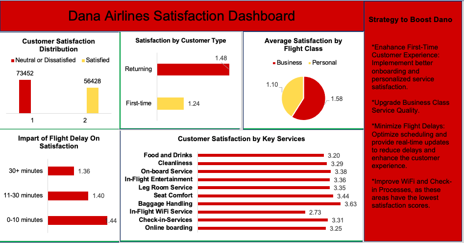

# Dana Airline Analysis

## Introduction
This project analyzes customer satisfaction and operatonal performance for **Dano Airlines** using Excel. By Leveraging a dataset obtained online,the goal is to uncover insights that can improve service quality and enhance the travel experience. All data and findings are fictional and intended for demonstration purposes.

**_Disclaimer_** : _All data and findings in this project are fictional and for demostration purposes only, using a dummy dataset to demonstrate capabilities of Excel. They do not represent any company or situation._

## Problem Statement
Dano Airlines has seen a decline in customer satisfaction, with ratings fallings belows 50% for the first time. Key issues include disparities among customer types,flight classes, and service areas. The Leadership team needs a data-driven strategy to increase satisfaction. Your task is to analyze the dataset and present actionable recommendations in a single-page report or dashboard.

## Skills and Concepts Demonstrated:

- Data cleaning and Preparation
- Filters and sorting
- Conditional Formattting
- Statistical functions( e.g, AVERAGE,COUNTIF)
- PivotTables 
- Charts and Visualizations 
- Dashboards.

## Visualizations Used

- Vertical Bar Chart
- Horizontal Bar Chart
- Pie Chart.

## Conclusion and Recommendations
The analysis of customer satisfaction data for Dana Airlines reveals critical areas for improvement to enhance overall passenger experience. By implementing the following strategies the airline can significantly boost its satisfaction ratings:
- **Enhance First-Time Customer Experience**: Implement personalized onboarding services.
- **Upgrade Business Class Quality**: Focus on improving service standards.
- **Minimize Flight Delays**: Optimize scheduling and provide real-time updates.
- **Improve WIFI and Check-in**: Address connectivity issues and streamline check-in processes.

-----

